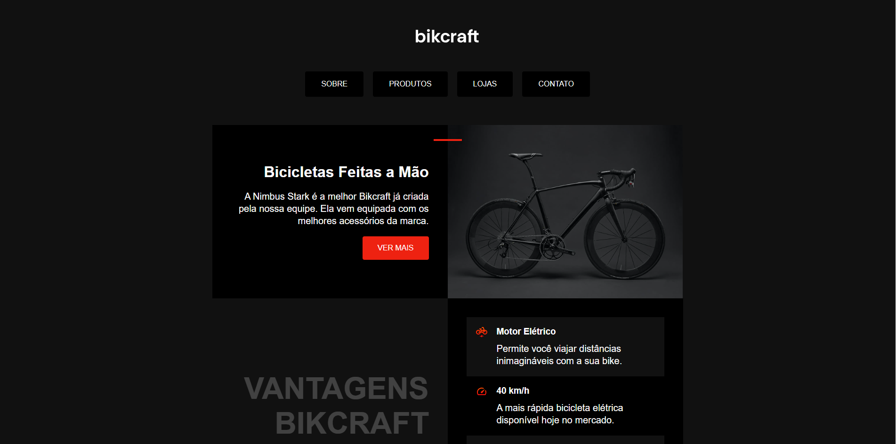

# Bikcraft
Bikcraft - Origamid

## Description
This is a project by [Origamid](https://www.origamid.com/) course. The project's main intention is study and realize a application near of a real life, using HTML and CSS.

## Learned
- Beginner HTML and CSS;
- Positioning CSS;
- Semantic HTML;
- CSS Properties;
- Responsive;

## Technologies Used
- HTML;
- CSS.

## Screenshots

 
*Subtitle: Screenshot of the main screen. Logo and nav menu on the top of image, one below the other, on the middle of image a big heading and paragraph, a button and side that a image of black bike.*

 

*Subtitle: Screenshot of the main screen. Logo and nav menu on the top of image, one below the other, on the middle of image a big heading and paragraph, a button and side that a image of black bike.*

## Links
- [Solution](https://viniciussnitram.github.io/bikcraft-prototype/)
- [LinkedIn](https://linkedin.com/in/viniciussmartins/)